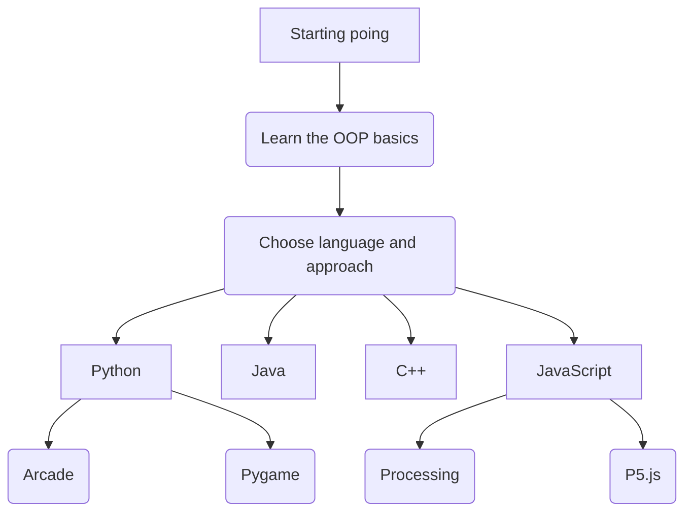

## Languages

Explore the following sections


  
  
  
  

___


  Below you’ll learn the main principles of object-oriented programming for problem-solving.


___

Choose the principle of your interest from the buttons below:


  
  
  
  

