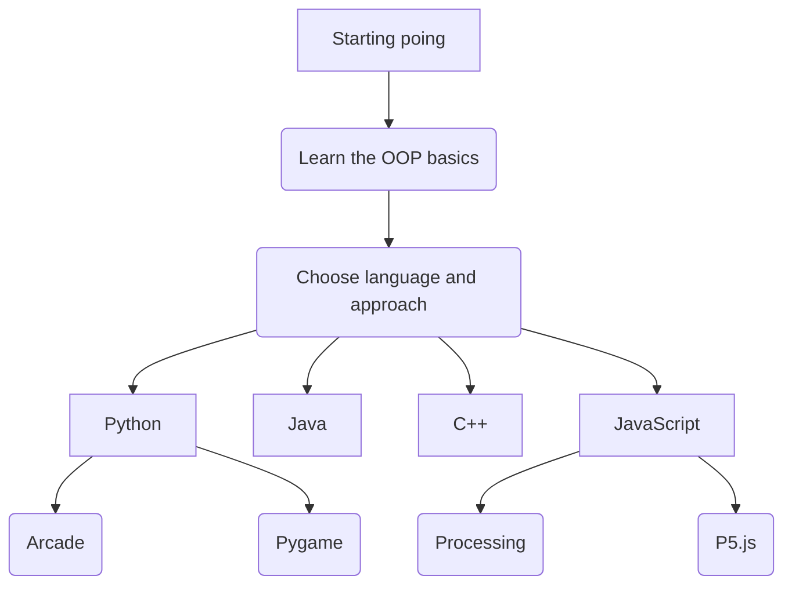
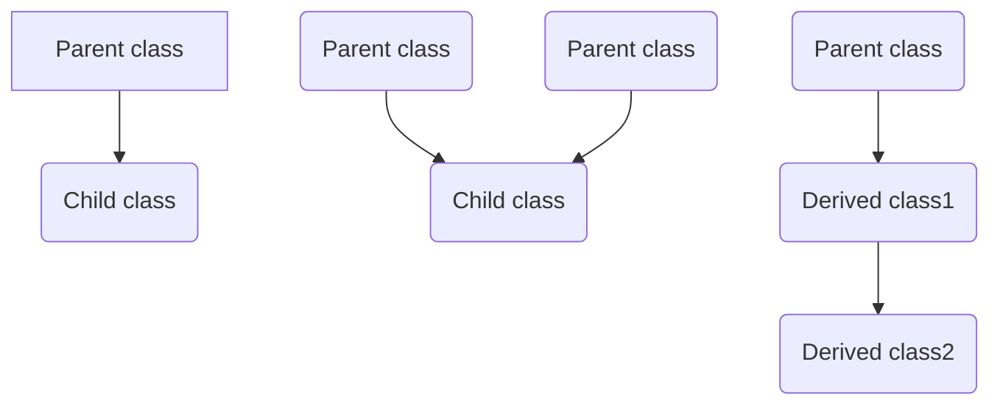
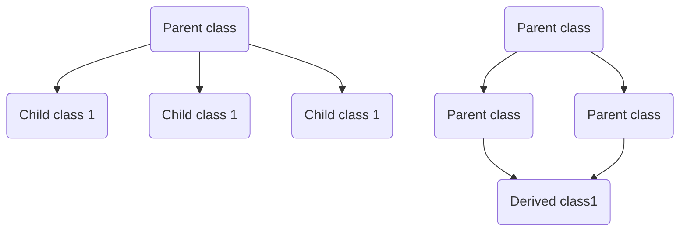

👋 Hello! Welcome to the Hextra documentation!

<!--more-->

# Object-oriented programming course

In this course, you'll learn the fundamental skills of ==object-oriented programming for problem-solving==.
Select the language and the approach that best suit your interests and follow the course path.

___
---

# Object-oriented programming concepts
## Class
A class is a user-defined data type. It consists of data members and member functions, which can be accessed and used by creating an instance of that class. It represents the set of properties or methods that are common to all objects of one type. A class is like a blueprint for an object.
Imagine we have a Class called "GameCharacter." Within the vast world of gaming, there can be a multitude of different characters, each with unique names, appearances, and abilities. However, despite their individuality, they often share certain common characteristics and behaviors that define what it means to be a "GameCharacter."
In this scenario, "GameCharacter" is the Class, and the shared attributes and behaviors are its properties. These properties could include fundamental aspects such as "Health Points," "Attack Power," "Movement Speed," and "Special Abilities." Regardless of whether a GameCharacter is a heroic knight, a cunning rogue, or a powerful wizard, they all possess these core properties.

|ㅤㅤㅤㅤㅤGameCharacterㅤㅤㅤㅤㅤ |
|:--:|
|int  healthPoints   int attackPower   int movementSpeed  |
| + attack( )   +defend( )   +move( ) |

---

## Object

  It is a basic unit of Object-Oriented Programming and represents the real-life entities. An Object is an instance of a Class. When a class is defined, no memory is allocated but when it is instantiated (i.e. an object is created) memory is allocated. An object has an identity, state, and behavior. Each object contains data and code to manipulate the data. Objects can interact without having to know details of each other’s data or code, it is sufficient to know the type of message accepted and type of response returned by the objects..
For example, a “Character" in a game possesses an identity, a state, and various behaviors. Each Character encapsulates both data, such as attributes like appearance, abilities, and inventory, and code that dictates how it interacts with the game world and responds to various events

 - Consider a "Knight" character within a game

|ㅤㅤIdentityㅤㅤ|ㅤㅤAttributesㅤㅤ|ㅤㅤBehaviors / Actionsㅤㅤ|
|:-:|:-:|:-:|
|Name  | Armor   Weapon   Health   Skills | Attack   Defend   Move   |

---
## Abstraction

  Data abstraction is one of the most essential and important features of object-oriented programming. Data abstraction refers to providing only essential information about the data to the outside world, hiding the background details or implementation.
Imagine a game character navigating through a complex virtual world. The player controlling the character interacts with the game using various commands and actions, such as moving the character, attacking enemies, or using special abilities. However, the player doesn't need to know the intricate details of how these actions are executed within the game's code.
n this scenario, the concept of abstraction comes into play. The player is abstracted from the underlying complexities of the game's mechanics. They only need to understand the high-level concepts, such as moving the character forward, using a powerful spell, or picking up an item, without being burdened by the technical specifics.

---
## Encapsulation

  Encapsulation is defined as the wrapping up of data under a single unit. It is the mechanism that binds together code and the data it manipulates. In Encapsulation, the variables or data of a class are hidden from any other class and can be accessed only through any member function of their class in which they are declared. As in encapsulation, the data in a class is hidden from other classes, so it is also known as <em>data-hiding</em>.
Imagine a game character with various attributes such as health, speed, and inventory items. These attributes are encapsulated within the character object. Other parts of the game, like enemy characters or game mechanics, can interact with the character's attributes only through predefined methods or interfaces.

For example, if an enemy character wants to damage the player character, it cannot directly access the player's health variable. Instead, it calls a method like "damagePlayer" provided by the player character's class. This method encapsulates the logic for reducing the player's health and ensures that it's done safely and consistently.
In essence, encapsulation in game development protects the integrity of an object's data and behavior. It allows game developers to control how different game elements interact with each other, promoting a more organized and maintainable game codebase.

---
## Inheritance

  Inheritance is an important pillar of OOP(Object-Oriented Programming). The capability of a class to derive properties and characteristics from another class is called Inheritance. When we write a class, we inherit properties from other classes. So when we create a class, we do not need to write all the properties and functions again and again, as these can be inherited from another class that possesses it. Inheritance allows the user to reuse the code whenever possible and reduce its redundancy.

---

## Languages

Explore the following sections to start adding more contents:


  
  
  
  


