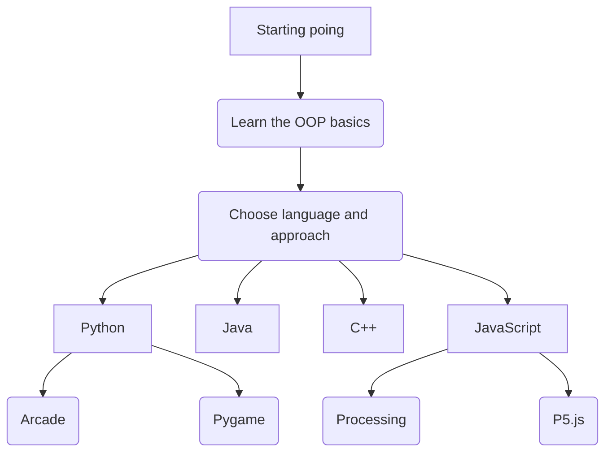

<!--more-->

In this course, you'll learn the fundamental skills of object-oriented programming for problem-solving.
Select the language and the approach that best suit your interests and follow the course path.

___
---


  In this module, you'll find the basic concepts that will help you understand OOP's paradigm basics.


___
Choose the concept of your interest from the buttons below


  
  
  
  
  


## Languages

Explore the following sections


  
  
  
  


