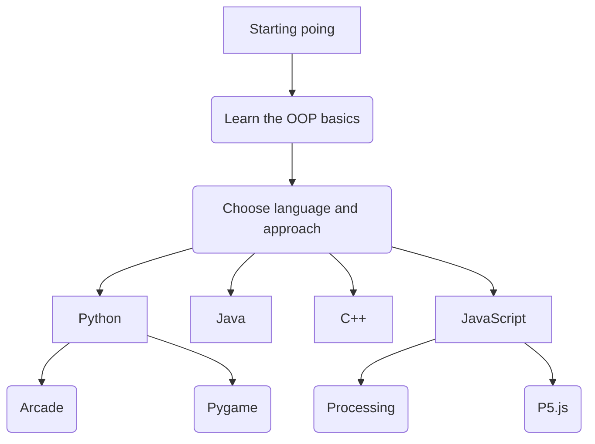

```mermaid
graph  TD
A[Starting poing]  -->  X(Learn the OOP basics)
X --> B(Choose language and approach)
B  -->  C[Python]
B  -->  D[Java]
B  -->  E[C++]
B  -->  F[JavaScript]
F  -->  G(Processing)
F  -->  H(P5.js)
C  -->  I(Arcade)
C  -->  J(Pygame)
```
___
---

## Languages

Explore the following sections to start adding more contents:


  
  
  
  


